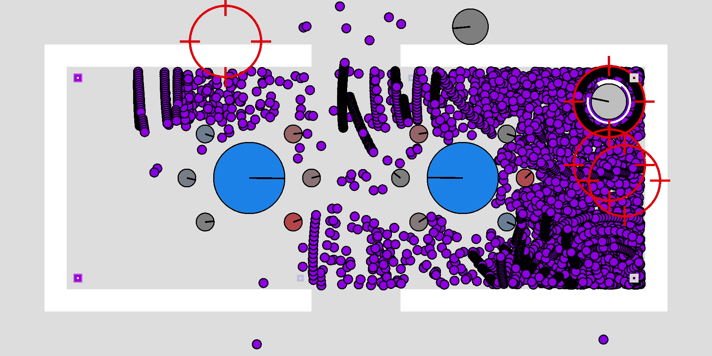

# PowerTanks Battle

The C++ upgrade of my [JavaScript game](https://uncreativeusername.neocities.org/tanks.html).

## Getting Started

(The video's small size is because GIFs don't have codecs for compression, and GitHub doesn't allow embedding MP4s...)

## Requirements

* OpenGL 3.3 or later
    * Earlier versions not supported; 3.3+ is required for instanced rendering of the bullets, allowing far better performance
    * Your GPU almost certainly supports this
        * Apparently there are some Windows ARM laptops that only support DirectX, so those aren't supported
* 3GHz+ CPU recommended
    * Faster CPU -> more bullets on screen
    * The game can use more than one core, and the performance increases somewhat, but not a lot
* ~200MB RAM
* No audio requirements, because there's no audio
* OS: Windows x64 or Linux x64
    * Mac OS dropped support for OpenGL when they switched to ARM, also I don't have a Mac to test on; if you want to try your luck, look into [ANGLE](https://en.wikipedia.org/wiki/ANGLE_(software))
    * ARM should be possible to support but I don't have an ARM device to test on, and RISC-V has extremely few consumer devices
    * If using the pre-built Windows binaries, a CPU with SSE4.2 is required (which is satisfied by nearly 100% of CPUs in active use today)

[Download here](https://github.com/khuiqel/tanks-game/releases) (Windows-only build; Linux has to compile from source, see below)

## Building from source

Clone this repository: `git clone https://github.com/khuiqel/tanks-game.git`

### Building (Windows)

#### Visual Studio

Visual Studio is the current supported buildsystem for Windows, using the `.sln` project. The `CMakeLists.txt` file will work but isn't perfect, so don't use it.

1. Note: Compiling profiling builds requires Windows SDK >10.0.19041.0, [probably >=10.0.20348.0](https://github.com/MicrosoftDocs/sdk-api/commit/55f67ad9d9f2f863b8efd41863920707658218fb), due to not having `RelationProcessorDie` in `LOGICAL_PROCESSOR_RELATIONSHIP` from `<winnt.h>`; might be avoidable by dropping to Tracy <0.12
1. Build ReleaseDistribution (on the solution, not project)
1. **[Pre-compiled executables](https://github.com/khuiqel/tanks-game/releases)** are provided if this isn't an option for you

#### CMake & MSYS2

Using CMake & Visual Studio, there's going to be issues but here's what to do:

1. `cmake -S . -B build`
    * If you are interested in testing things out yourself, specify `-DCMAKE_BUILD_TYPE=[Release|Debug]`, because by default a few things are modified to act like an end-user product (by "a few" I mean just the dev mouse controls are always enabled if you specify the build type)
1. Either open the `.sln` project that was just created or run `cmake --build build --config [Release|Debug] --target tanks-game`
    * TODO: For some reason, every file gets compiled twice... I don't know why.
1. TODO: also needs `res/` (and `mods/`) copied to the build dir

Using MSYS2, it's a pain but works:

1. Prerequisites: [`pacman -S --needed base-devel mingw-w64-ucrt-x86_64-toolchain mingw-w64-ucrt-x86_64-glfw` and add your `msys64/ucrt64/bin` folder to PATH](https://code.visualstudio.com/docs/cpp/config-mingw)
1. TODO: disable rpmalloc: set `USE_RPMALLOC` in CMake to `OFF` and comment out `#include <rpnew.h>` in `aaa_first.cpp`
1. `cmake -S . -B build -G "MinGW Makefiles"`
1. `cmake --build build -j%NUMBER_OF_PROCESSORS%`
1. TODO: also needs `res/` (and `mods/`) copied to the build dir

### Building (Linux)

1. Prerequisites: a compiler, Make, CMake, GLFW (optional)
    * Ubuntu/Mint: `sudo apt install build-essential cmake libglfw3-dev`
    * Fedora: `sudo dnf install gcc-g++ make cmake glfw-devel`
    * Arch/Manjaro: `sudo pacman -S gcc make cmake glfw`
    * You can compile GLFW from source instead if desired. Disable the `USE_SYSTEM_GLFW` option in CMake and make sure you have the GLFW submodule (`git submodule update --init` if you didn't recursively download).
    * If your monitor scaling isn't 100% and you are using Wayland, the game will not fill the whole window until the window is resized, and the dev mouse controls will have an incorrect position. This is a GLFW problem, and fixing it requires using X11 (disable `GLFW_BUILD_WAYLAND` in CMake) or using an older version to make X11 the default (`git checkout 3.3.10` in the submodule).
1. `cmake -S . -B build` (optional and recommended: `-DCMAKE_CXX_FLAGS=-march=native -DCMAKE_C_FLAGS=-march=native`)
    * If you are interested in testing things out yourself, specify `-DCMAKE_BUILD_TYPE=[Release|Debug]`, because by default a few things are modified to act like an end-user product (by "a few" I mean just the dev mouse controls are always enabled if you specify the build type)
1. `make -j$(nproc)`
1. TODO: also needs `res/` (and `mods/`) copied to the build dir
1. Note: On Ubuntu, going fullscreen seems to force the window to the largest monitor, unless "Auto-hide the Dock" is enabled. It appears that Ubuntu forces windows that are too large for the current screen (which means full height is too much due to the dock) to the largest screen.

### Performance profiling using [Tracy](https://github.com/wolfpld/tracy)

Requires having the Tracy submodule. Either recursively clone this repository when first downloading, or `git submodule update --init` if you've already cloned this repository.

Windows: build on ReleaseProfiling

Linux: enable the `USE_TRACY` option in CMake

### Linux display issues

After *extensive* testing, I have found that not all distributions and desktop environments play nicely. Nearly all can compile and run the game, however they will not necessarily display anything. Some of them only work under X11, maybe due to incorrect environment parameters getting passed on to GLFW (I really don't know, I'm not a Linux display system expert). Here's what I've found:

Works without issue:

* Ubuntu 22.04/24.04 GNOME
* Linux Mint 21/22 Cinnamon & Xfce
* Fedora Xfce
* Arch Xfce & MATE
* Manjaro Plasma & GNOME & Xfce & Cinnamon

Works with workarounds:

* Ubuntu 25.04: switch to X11 (*first* select your user, *then* click the gear in the bottom right)
    * 24.04 works just fine but 25.04 doesn't because the GLFW library version bump (3.3.10 to 3.4) made Wayland preferred, and it seems GLFW isn't ready for Wayland yet
* Fedora Plasma: switch to X11 (select the text in the bottom left), requires `sudo dnf install plasma-workspace-x11`

Doesn't work but might (I tested all of these in a virtual machine, so bare metal might fare differently):

* Arch Plasma & GNOME

Doesn't work:

* Fedora GNOME (no X11 option)

Untested:

* Gentoo
* Alpine

## Features

Everyone loves marketing! Enjoy these bullet points and let them compel you to purchase this game for the low price of $0! And it's on sale, or something.

* Unlimited power mixing: grab a powerup, grab another, and keep going, because you can stack as many as you like!
* Non-stop action: Stay on your toes as you dodge hazards to collect a hidden powerup! Respawning is fast and frequent, with many levels to play on.
* Customizability: Several options are available to change! Try setting `ShootingCooldown` to 0 and play a few rounds!
* Custom levels and powers: Bring out your creativity with custom levels and powers!
* Lots of content: ~22 powers, 12 hazards, ~17 levels, 6 level effects

It's free. Play it if you want, don't if you don't want to.

## Making custom levels

Making your own levels is now a thing! (Although the levels are very simple, and they take a while to make.) How to do so:

1. Navigate to the `mods` folder.
1. Add a new folder. This will be the name of your mod.
1. Add a `levels` folder to your mod's folder. Your custom levels go here.
1. Add some text files and make your custom levels!
1. Several fields need to be given. I suggest looking at one of the pre-made custom levels and copying it and modifying it.
1. Every level needs a `Name` (string), `Color` (3 floats in range [0,1] for RGB), `LevelTypes` (at least one string; recommended "modname" and "random-modname"), and `LevelWeights` (1 float for each type; recommended 1.0 is the base weight).
1. Optionally, levels can contain a `RandomStartPositionCount` (int, default = 5, for number of starting positions), `RandomStartPositionXValue` (float, default = 20, x-distance from edge), and `RandomStartPositionYRange` (float, default = 256=320-2\*32, y-range for starting positions).
1. Once the assignments have been set, `[LEVEL_START]` needs to appear, then you can start adding walls and powers and stuff.
1. Look at `docs/custom-levels.md` for more information.

The custom level interpreter is very simple and barebones, so if you want to put something at the center, you have to put the coordinates as `320 160` instead of `GAME_WIDTH/2 GAME_HEIGHT/2`. Also you can't do any math to your numbers; they need to be the raw numbers (no "sqrt(3)" or "20\*8", just "5" or whatever). I know this sucks but adding an expression parser is annoying [(although there is a popular library for this task)](https://github.com/ArashPartow/exprtk) and adding Lua (or maybe Python?) would've been a much larger hurdle [(although this Wikipedia list is much larger than the last time I looked at it so maybe it's easier than I thought?)](https://en.wikipedia.org/wiki/List_of_applications_using_Lua).

## Making custom powers

Making your own powers is also now a thing! (Although very limited.) How to do so:

1. Follow the same steps as making custom levels, but add a `powers` folder in your mod's folder.
1. Every power needs a `Name` (string), `Color` (3 floats in range [0,1] for RGB), `PowerTypes` (at least one string; recommended "modname" and "random-modname"), and `PowerWeights` (1 float for each type; recommended 1.0 is the base weight).
1. Optionally, powers can contain a `PowerTankDurationMultiplier` (float, default = 1.0, for the duration the tank has the power) and `PowerAttributes` (strings, default = "stack" and "mix", just something to help when randomizing powers)
1. Once the assignments have been set, do `[TANKPOWER_START]` to set up the tank power, then `[BULLETPOWER_START]` to set up the bullet power.
1. Check the provided powers for syntax and stuff. They contain basically every operation currently available.
1. Look at `docs/custom-powers.md` for more information.

The custom power interpreter is also very simple and barebones.

## Running the tests

~~Will come soon™.~~

## Documentation

I didn't find a good way to easily build documentation, so... the documentation is quite lacking. However, there is some. Check the `docs` folder.

## Built With

* [Visual Studio (2022)](https://visualstudio.microsoft.com/) - C++ IDE from Microsoft
* [Visual Studio Code](https://code.visualstudio.com/) - Code editor when not on Windows
* [GLFW](https://www.glfw.org/) - OpenGL Framework (or Graphics Library Framework); cross-platform way to make windows and get inputs
* [Glad2](https://gen.glad.sh/) - OpenGL Loader-Generator; for getting the latest OpenGL commands (where "latest" is >1.1)
* [OpenGL Mathematics (GLM)](https://github.com/g-truc/glm) - OpenGL-happy matrix and vector math library
* [enkiTS](https://github.com/dougbinks/enkiTS) - Thread scheduler for easily managing multithreading
* [rpmalloc](https://github.com/mjansson/rpmalloc) - Memory allocator, for some extra performance
* [stb_image](https://github.com/nothings/stb) - Image loader for loading the window icon
* [Tracy](https://github.com/wolfpld/tracy) - Performance profiler (note: only used in development, not used in builds meant to be used by users for obvious reasons)

## Contributing

This is my personal project so I won't be taking others' contributions. (Plus I've learned so much and would rather make a sequel at this point.) If you wanna do something with this project, you can fork this repository and do whatever you want.

## License

GNU General Public License v3.0

`SPDX-License-Identifier: GPL-3.0-only`

## Acknowledgments

* JS Tanks (made by me): [tanks.html](https://uncreativeusername.neocities.org/tanks.html)
    * the JS version has significantly less stuff and way worse power mixing, so play this C++ version instead!
* Many people across the Interwebs who made StackOverflow and other forum posts
* Lots of YouTube tutorials, GDC talks, and my CS professors providing assistance
* The vague inspiration I had for this game back when I made it: some top-down Flash tank game. I've tried searching for it multiple times but have never found it, so given my continuously fading memories of that game I played, I'll probably never find out what it actually was. (No, it wasn't Wii Tanks (that's not a Flash game, come on!). I think the game had a more cartoonish than realistic artstyle. I don't remember if there were powerups. My closest guess was some old Atari game remade in Flash, but my searches didn't find anything useful.)

## More acknowledgements

* [Super Smash Bros.](https://www.smashbros.com/en_US/index.html) for being a very fun game
    * (Smash Bros the *party* game, not the competitive fighting game; use items!)
* [The Cherno](https://www.youtube.com/@TheCherno/videos) is very helpful for OpenGL
* [Factorio](https://www.factorio.com/)'s Friday Fun Facts are amazing and got me interested in low-level C++ optimizations
* [Nitronic Rush](https://nitronic-rush.com/) is the other game that made me want to learn C++ in the first place
* [Dolphin emulator's Progress Reports](https://dolphin-emu.org/blog/) for being very in-depth and good reading material
* [N++](https://www.nplusplus.org/) for just being a good game (also the developers had some [good GDC talks](https://www.youtube.com/watch?v=VZ4xevskMCI) and have a [useful game development blog](https://www.metanetsoftware.com/technique/tutorialAbak.html))
* [Creeper World](https://knucklecracker.com/creeperworld4/cw4.php) for also just being a good game
* [Outer Wilds](https://www.mobiusdigitalgames.com/outer-wilds.html) for just being a really good game
